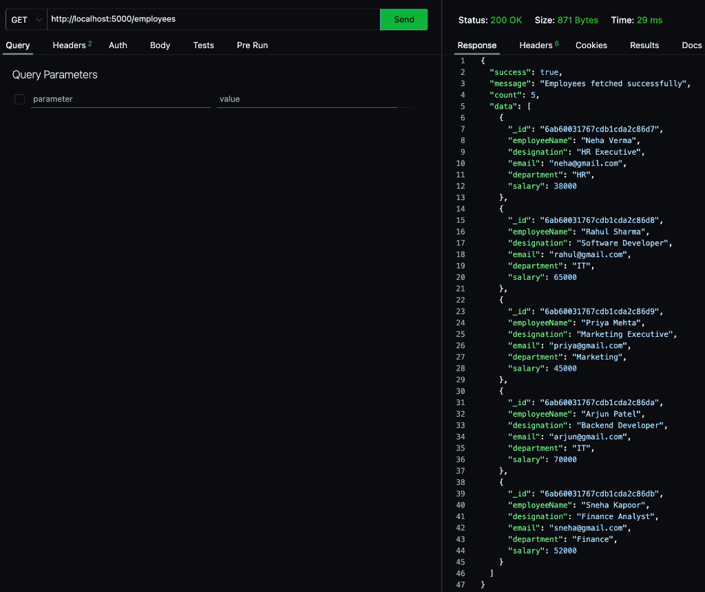
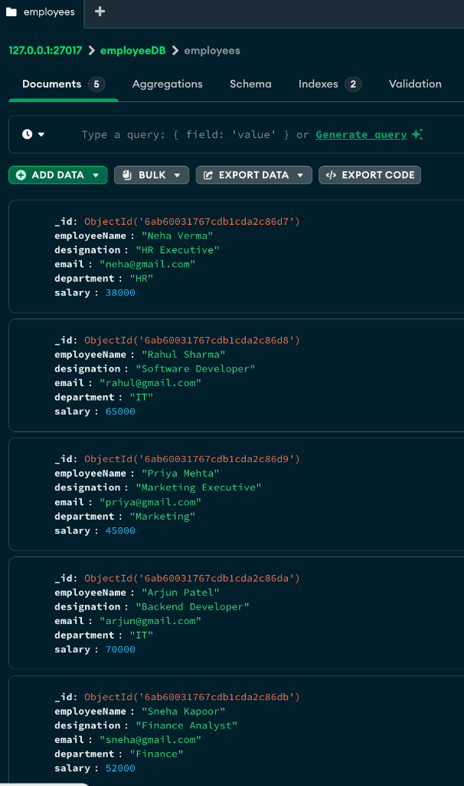

# Q4 Mongo Employees

This project is a RESTful API demonstrating the integration of MongoDB with Node.js/Express to manage employee data.

## Steps to Run the Project

1. Ensure you have Node.js and MongoDB installed on your system.
2. Clone this repository to your local machine.
3. Open a terminal and navigate to the project directory: `cd q4-mongo-employees`
4. Install the required dependencies:
   ```bash
   npm install
   ```
5. Ensure your local MongoDB server is running.
6. Start the Express server:
   ```bash
   npm start
   # or node server.js (depending on your package.json setup)
   ```
7. The API will now be running (typically on `http://localhost:5000` or the port specified in your server code).

## Screenshots

### 1. Successful GET `/employees` Response


### 2. MongoDB Compass Displaying 5+ Documents

